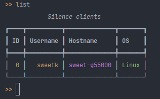
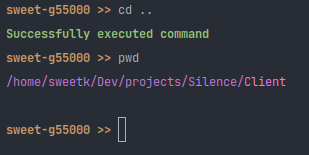

# Silence

---

### 👾 Discover the darkness 👾

Silence is a modern spyware / RAT with many features. Documenation and windows example are coming soon. This piece of
malware uses socket.io to communicate between client and server. 

**_This project is for educational purposes only._**

---

### 💜 Features 💜

- [ ]  Encryption
- [x]  Fast
- [x]  Shell to execute commands
- [x]  View filesystem
- [ ]  Better stealth
- [ ]  Persistance
- [x]  Upload files to client
- [x]  Download file from client
- [x]  Get system information
- [x]  See live stream of clients desktop
- [x]  Access webcam
- [x] Execute any system commands
- [x]  Multiplatform (not **everything** works on MacOS)

---

 
 

---

### 😈 Libraries 😈

- openCV
- cpp-httplib
- socket.io-client-cpp (with deps)

---

### 📉 Planning 📉

- WebUI
- Smaller client
